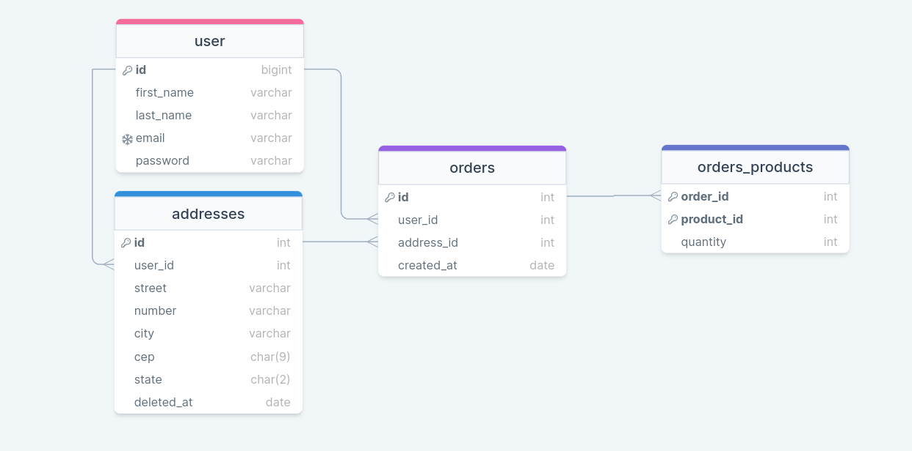

# Desafio técnico Devnology.

## Rodando o código.

Clone o repositório e entre na pasta com:

```bash
$ git clone https://github.com/gralmeidan/devnology.git
$ cd devnology
```

Suba os contâineres do banco de dados e do back-end com:

```bash
$ docker-compose up -d
```

Isso irá automaticamente iniciar o servidor do back-end e restaurar o banco de dados, a pasta `back/src` será atualizada automaticamente quando houver mudanças, mas caso haja alguma mudança na raiz do projeto deve-se subir o contâiner novamente.

<details>
 <summary>Rodando os testes</summary>

Para rodar os testes do backend entre no contâiner com:

```bash
$ docker exec -it app_back sh
```

E rode o comando:

```bash
$ npm test
```

Para ter a cobertura de testes utilize o comando:

```bash
$ npm run test-coverage
```

</details>

### Rodando o front pelo VSCode

Caso tenha o VSCode com a extensão do Flutter instalada, abra-o na pasta do front com:

```bash
$ code front
```

E pressione F5 para rodar o código.

### Rodando o front pela CLI

Caso prefira rodar pela CLI utilize os seguintes comandos:

```bash
$ cd front/
$ flutter run -d chrome --web-renderer=html --web-port=43195
```

## Processo de desenvolvimento

Como esse foi o meu primeiro projeto usando Flutter e Dart, meu primeiro passo foi ler a documentação para ambas, em especial as páginas que tratam sobre a transição [de JavaScript para Dart](https://dart.dev/guides/language/coming-from/js-to-dart) e [de HTML/CSS para Flutter](https://docs.flutter.dev/get-started/flutter-for/web-devs).

Em toda integração com a API eu comecei criando uma classe pra representar a entidade à ser buscada com um construtor alternativo que também servisse como Adapter para retornar uma instância a partir de um Map, e uma classe Service que ficaria responsável por tratar de todas as requisições relacionadas à entidade.

Na tela de listagem dos produtos eu preferi juntar o resultado das duas APIs visto que raramente se vê um site de e-commerce que separe por provedor, e pelo volume de dados ser pequeno, me aproveitei das funcionalidades nativas do `ListView.builder` pra criar uma tela sem paginação com sensação de _Infinite Scrolling_.

Para o gerenciamento de estado eu optei pelo `ChangeNotifier` da bilioteca `Provider` por ter uma implementação semelhante ao `Context API` que eu já estava familiarizado, inicialmente com apenas um provider para o `Cart` mas adicionando mais providers conforme necessário.

Para salvar os pedidos do usuário eu acabei optando por usar a stack que eu aprendi na Trybe, com uma API em node com TypeScript, testes unitários com Mocha e Chai, e Sequelize como ORM em uma arquitetura Model Service Controller, nesse caso substituindo a Model por Repository pra não criar confusão com as models do Sequelize. Para banco de dados utilizei o MySQL seguindo este diagrama:



Para poder relacionar os pedidos com um usuário eu comecei criando as rotas tanto no front quanto no back de autenticação de usuário, com telas de login e de cadastro onde a API retornaria um _Json Web Token_ que seria necessário para a criação de pedidos.
